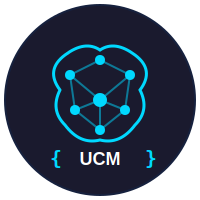

<p align="center">
  
</p>

<h1 align="center">Universal Context Memory (UCM)</h1>

<p align="center">
  <strong>🧠 Auto-indexing memory for AI coding assistants — baked into your project</strong>
</p>

<p align="center">
  <a href="https://www.npmjs.com/package/universal-context-memory"></a>
  <a href="https://github.com/LyceumAI/universal-context-memory/blob/main/LICENSE"></a>
  <a href="https://github.com/LyceumAI/universal-context-memory/actions"></a>
  <a href="https://discord.gg/lyceumacademy"></a>
</p>

<p align="center">
  <a href="#-the-problem">Problem</a> •
  <a href="#-the-solution">Solution</a> •
  <a href="#-installation">Installation</a> •
  <a href="#-quick-start">Quick Start</a> •
  <a href="#-commands">Commands</a> •
  <a href="#-how-it-works">How It Works</a> •
  <a href="#-contributing">Contributing</a>
</p>

---

## 🎯 The Problem

When your conversation with AI coding assistants gets long, they "forget" your codebase and start hallucinating:

```
You: "Add a logout function"

AI (after long conversation): *Creates a completely new auth system 
instead of using your existing AuthService*

You: 😤
```

**Why does this happen?** Claude Code, Cursor, Copilot, and Codex don't maintain persistent memory of your codebase structure. Every message competes for limited context window space.

## ✅ The Solution

UCM indexes your entire codebase and generates **tool-specific context files** that AI assistants automatically read:

```bash
# Install UCM in your project
npm install universal-context-memory

# Index your codebase
npx ucm init

# That's it! Now Claude Code, Cursor, and Copilot 
# automatically understand your codebase
```

### What Gets Created

```
your-project/
├── .context/
│   └── index.json          # Full codebase index (committed to git)
├── CONTEXT.md              # Generic LLM context  
├── CLAUDE.md               # Claude Code specific
├── .cursorrules            # Cursor IDE rules
└── .github/
    └── copilot-instructions.md  # GitHub Copilot
```

**Commit these files to Git** → Your entire team gets the same context!

## 🔥 Features

| Feature | Description |
|---------|-------------|
| **Auto-indexing** | Indexes functions, classes, types, interfaces, and dependencies |
| **10+ Languages** | TypeScript, JavaScript, Python, Rust, Go, Java, C#, Ruby, PHP, Swift, Kotlin, Scala, C/C++ |
| **Multi-tool Support** | Claude Code, Cursor, GitHub Copilot, any LLM |
| **Watch Mode** | Auto-updates on file changes |
| **Portable** | Index lives in your project, works offline |
| **Zero Config** | Works out of the box |
| **Fast** | Indexes 10k+ files in seconds |

## 📊 UCM vs. Other Tools

| Feature | UCM | Augment Code | Cursor | Cody |
|---------|-----|--------------|--------|------|
| Index location | **In your project** | Their cloud | Their cloud | Their cloud |
| Works offline | ✅ | ❌ | ❌ | ❌ |
| Code privacy | ✅ 100% local | ❌ Uploaded | ❌ Uploaded | ❌ Uploaded |
| Works with any LLM | ✅ | ❌ | ❌ | ❌ |
| Shareable via Git | ✅ | ❌ | ❌ | ❌ |
| Open source | ✅ | ❌ | ❌ | Partial |
| Free | ✅ | Paid | Paid | Freemium |

## 📦 Installation

### NPM (Recommended)

```bash
# Install in your project
npm install universal-context-memory

# Or globally
npm install -g universal-context-memory
```

### Yarn

```bash
yarn add universal-context-memory
```

### PNPM

```bash
pnpm add universal-context-memory
```

### Manual (from source)

```bash
git clone https://github.com/LyceumAI/universal-context-memory.git
cd universal-context-memory
npm install
npm run build
npm link
```

## 🚀 Quick Start

### 1. Initialize your project

```bash
cd your-project
npx ucm init
```

Output:
```
🚀 Initializing Universal Context Memory...

✅ Created .contextignore
✅ Indexed 47 files, 312 symbols
✅ Generated context files:
   - CONTEXT.md (generic LLM context)
   - CLAUDE.md (Claude Code specific)
   - .cursorrules (Cursor IDE)
   - .github/copilot-instructions.md (GitHub Copilot)

📁 Index stored in .context/

💡 Tip: Commit these files to share context with your team!
```

### 2. Commit the files

```bash
git add .context CONTEXT.md CLAUDE.md .cursorrules .github/copilot-instructions.md
git commit -m "Add UCM context files"
```

### 3. Use your AI assistant

Now when you use Claude Code, Cursor, or Copilot, they'll automatically read your context files and understand your codebase!

## 📖 Commands

### `ucm init`

Initialize UCM in a project. Creates `.contextignore`, indexes the codebase, and generates all context files.

```bash
npx ucm init
npx ucm init --silent  # Suppress output
```

### `ucm index`

Re-index the codebase and regenerate context files.

```bash
npx ucm index
npx ucm index --path /other/project
npx ucm index --no-generate  # Index only, don't regenerate files
```

### `ucm watch`

Watch for file changes and auto-update context files.

```bash
npx ucm watch
```

### `ucm stats`

Show statistics about the indexed codebase.

```bash
npx ucm stats
```

Output:
```
📊 my-project - Index Statistics
──────────────────────────────────────────────────
Files indexed:     47
Symbols extracted: 312
  - Functions:     89
  - Classes:       23
  - Interfaces:    45
  - Types:         67
  - Constants:     88
Dependencies:      89
Entry points:      3
```

### `ucm query <term>`

Search the index for symbols, files, or content.

```bash
npx ucm query "auth"
npx ucm query "createUser"
npx ucm query "User"
```

Output:
```
🔍 Found 8 results for "auth":

  [function  ] login
               src/auth/index.ts:15

  [class     ] AuthService
               src/auth/index.ts:28

  [interface ] AuthConfig
               src/auth/index.ts:8

  [file      ] src/auth/index.ts
```

### `ucm export`

Export the index as JSON for external tools.

```bash
npx ucm export
npx ucm export --output my-index.json
```

### `ucm clean`

Remove all generated context files.

```bash
npx ucm clean
```

## 🔧 Configuration

### `.contextignore`

Exclude files from indexing (in addition to `.gitignore`):

```
# Files to exclude from context indexing

# Large generated files
*.min.js
*.bundle.js
*.chunk.js

# Test fixtures
__fixtures__/
__mocks__/

# Documentation builds
docs/build/
site/

# Add project-specific excludes:
vendor/
```

### Programmatic API

```typescript
import { Indexer, ContextGenerator } from 'universal-context-memory';

// Index a project
const indexer = new Indexer({ projectRoot: '/path/to/project' });
const index = await indexer.index();

// Generate context files
const generator = new ContextGenerator({ projectRoot: '/path/to/project', index });
generator.generateAll();

// Or quick one-liner
import { indexProject } from 'universal-context-memory';
await indexProject('/path/to/project');
```

## 🔍 How It Works

### Architecture

```
┌─────────────────────────────────────────────────────────────────────┐
│  YOUR PROJECT (with UCM installed)                                  │
├─────────────────────────────────────────────────────────────────────┤
│                                                                     │
│  .context/                    ← Bundled Index (committed to git)    │
│  └── index.json               ← File map + exports + dependencies   │
│                                                                     │
│  CONTEXT.md                   ← Auto-generated for any LLM          │
│  CLAUDE.md                    ← Claude Code reads this              │
│  .cursorrules                 ← Cursor reads this                   │
│  .github/copilot-instructions.md  ← GitHub Copilot reads this       │
│                                                                     │
└─────────────────────────────────────────────────────────────────────┘
                              │
         ┌────────────────────┼────────────────────┐
         ▼                    ▼                    ▼
   ┌──────────┐        ┌──────────┐        ┌──────────┐
   │ Claude   │        │ Cursor   │        │ Copilot  │
   │ Code     │        │          │        │          │
   │          │        │          │        │          │
   │ Reads:   │        │ Reads:   │        │ Reads:   │
   │ CLAUDE.md│        │.cursorrules│      │copilot-  │
   │          │        │          │        │instructions│
   └──────────┘        └──────────┘        └──────────┘
```

### What Gets Indexed

UCM extracts:

- **Functions**: Name, parameters, return type, async/export modifiers
- **Classes**: Name, methods, properties, extends/implements
- **Interfaces**: Name, properties, methods
- **Types**: Type aliases and their definitions
- **Constants**: Exported constants and their values
- **Imports**: Import relationships between files
- **Dependencies**: Which files depend on which

### Supported Languages

| Language | Extensions | Symbol Extraction |
|----------|------------|-------------------|
| TypeScript | `.ts`, `.tsx` | Full |
| JavaScript | `.js`, `.jsx`, `.mjs`, `.cjs` | Full |
| Python | `.py` | Full |
| Rust | `.rs` | Full |
| Go | `.go` | Full |
| Java | `.java` | Full |
| C# | `.cs` | Full |
| Ruby | `.rb` | Full |
| PHP | `.php` | Full |
| Swift | `.swift` | Full |
| Kotlin | `.kt`, `.kts` | Full |
| Scala | `.scala` | Full |
| C/C++ | `.c`, `.cpp`, `.h`, `.hpp` | Basic |

## 🤝 Contributing

We welcome contributions! UCM is part of the **Lyceum AI Academy** mission to make AI-assisted development accessible to everyone.

### Quick Start

```bash
# Fork and clone
git clone https://github.com/YOUR_USERNAME/universal-context-memory.git
cd universal-context-memory

# Install dependencies
npm install

# Build
npm run build

# Run tests
npm test

# Link for local testing
npm link
```

### Ways to Contribute

- 🐛 **Report bugs** - Open an issue with reproduction steps
- 💡 **Suggest features** - Open an issue with your idea
- 📝 **Improve docs** - Fix typos, add examples, clarify explanations
- 🌍 **Add language support** - Extend the indexer for new languages
- 🔧 **Fix bugs** - Pick up issues labeled `good first issue`
- ⭐ **Star the repo** - It helps more people discover UCM!

See [CONTRIBUTING.md](CONTRIBUTING.md) for detailed guidelines.

## 📜 License

MIT License - see [LICENSE](LICENSE) for details.

## 🙏 Acknowledgments

- Inspired by [Augment Code](https://augmentcode.com) for proving context engines matter
- Built with love by [Lyceum AI Academy](https://lyceumaiacademy.com)
- Special thanks to all contributors!

## 📬 Contact

- **Discord**: [Join our community](https://discord.gg/lyceumacademy)
- **Twitter**: [@LyceumAI](https://twitter.com/Lyceumaiacademy)
- **Email**: support@lyceumaiacademy.com
- **BuyMeCoffee**: https://buymeacoffee.com/s2fstudio 

---

<p align="center">
  <strong>Built with ❤️ for the AI-native developer community</strong>
</p>

<p align="center">
  <sub>Part of the <a href="https://lyceumaiacademy.com">Lyceum AI Academy</a> mission to train 100,000 students in Context Engineering by 2030</sub>
</p>


